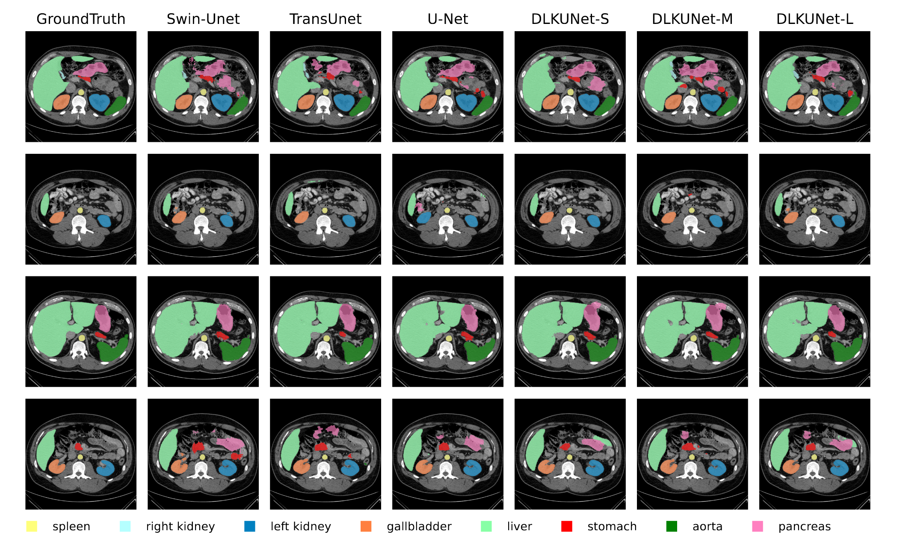

# Visualization_Medical_Images
A Python-based toolkit for generating high-quality visualizations of medical image segmentation results from popular datasets including Synapse, BraTS, and ACDC.

## 1. Structure
The repository is organized as follows:
```text
./
├── ACDC
│   ├── DLKUNet-S
│   ├── GroundTruth
│   ├── RenderOutput
│   ├── Source
│   ├── Swin-Unet
│   ├── TransUnet
│   └── U-Net
├── README.md
├── Synapse
│   ├── DLKUNet-S
│   ├── GroundTruth
│   ├── RenderOutput
│   ├── Source
│   ├── Swin-Unet
│   ├── TransUnet
│   └── U-Net
├── VisualizationCode.py
├── VisualizationCode_Pancreas.py
└── Visualization_Meta.yaml
```
For proper setup, please configure the paths in [Visualization_Meta.yaml](./Visualization_Meta.yaml) before running the scripts.

## 2. Usage Instructions
### General Visualization
For standard visualization without class-specific bounding boxes:

```python
python VisualizationCode.py
```

### Pancreas-specific Visualization
To generate visualizations with bounding boxes highlighting the pancreas (last class in YAML configuration):

```python
python VisualizationCode_Pancreas.py
```

## 3.Output
All rendered images will be saved in the respective `RenderOutput` directories, maintaining the original directory structure.


also you can change the output format such as PNG/JPEG/PDF/SVG...